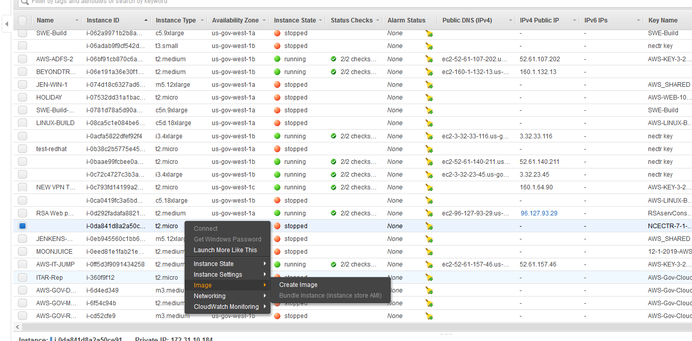
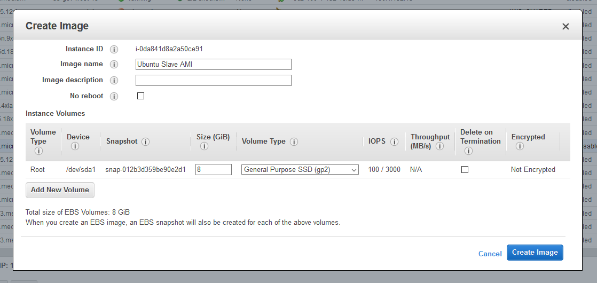
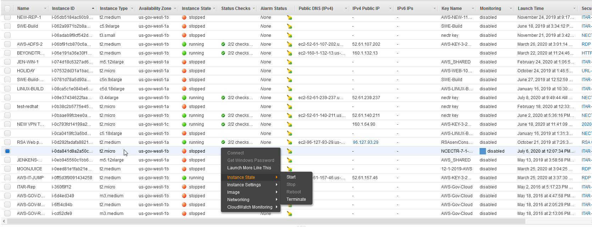
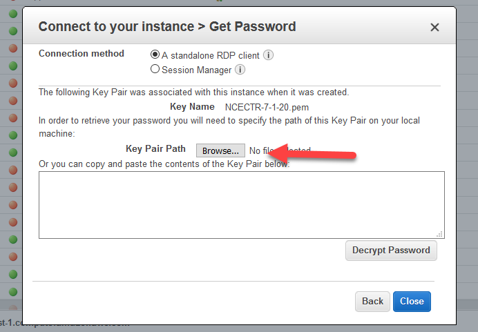
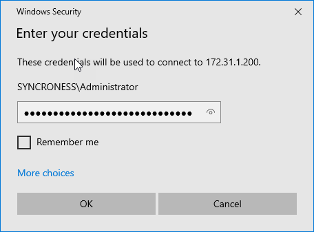
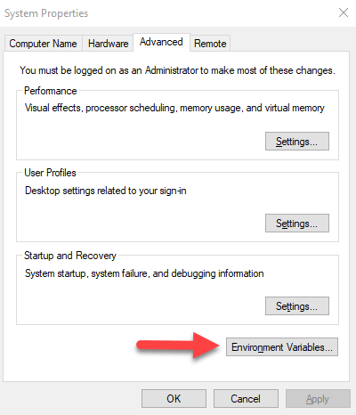
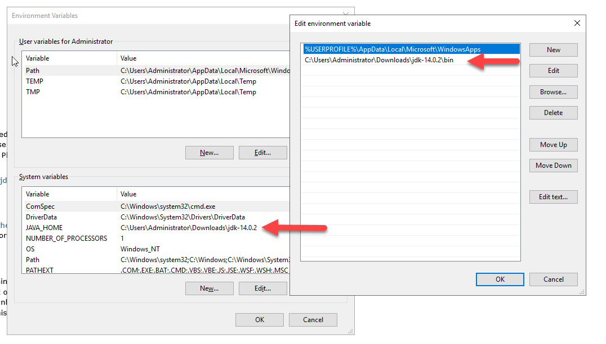
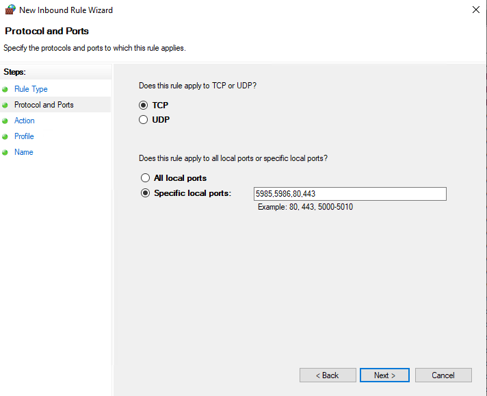
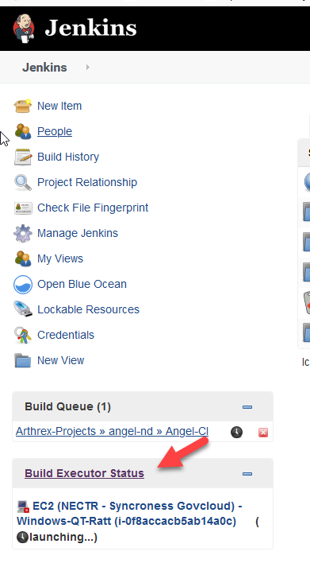
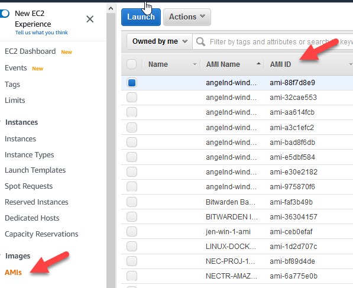

# Creating AMI for Jenkins slaves -- LINUX
Navigate to the AWS EC2 console, by logging in and typing EC2 in the search bar.

Click the orange Launch instance button and select Launch instance.

Select the appropriate base distro to create your own image. Here we'll use Ubuntu Server 20.04 LTS(HVM), SSD Volume Type. Generallly, select the newest version unless otherwise needed.

Select the appropriate instance type based on virtual CPUs/Memory size. For example, we'll use t2.micro. After selecting the right type, click Next until reaching the security group menu.
Click "Select an existing security group" and choose "ITAR-Sync-Only". Then click "Review and Launch". On the next page click "Launch".

You will need to have a key pair for authentication (.ppk saved on your local machine). Choose your key pair and click "Launch Instance". Then click "View Instances". Locate your instance, right click -> Networking -> Manage IP Addresses and copy your private IP.

Once your instance is running, launch PuTTY to connect to it via ssh. Under host name paste your private IP. 

Then, under SSH->Auth, click Browse and locate your .ppk private key

Click "Open" and login as your distro's default user.

We'll need to install OpenJDK/JRE. Use your distro's package manager. In the case of Ubuntu, run:

`sudo apt-get update`

`sudo apt-get install openjdk-8-jdk`

After this, navigate to the etc directory by typing: 

`cd /`

`cd etc`

In this folder, type: 
`sudo chmod 644 resolv.conf`

Then, we need to edit this file. Using any text editor, open resolv.conf and change its contents to:

`options timeout:2 attempts:5`  
`; generated by /sbin/dhclient-script`  
`search us-gov-west-1.compute.internal`  
`nameserver 192.168.15.224`

Save the changes.

Any other job specific tools should be added as well.

Now we can create a new AMI. Head back to the EC2 running instances console and right click on the created instance. Select Image -> Create Image.

In the box put in the disk size you want for your AMI, and uncheck the box saying "Delete on Termination". Then create the image.

Once the image has been made, the EC2 instance can be terminated.

# Creating AMI for Jenkins slaves -- WINDOWS

Launch the instance the same way as the linux instance but choose the Windows version you'd like instead of linux distro. Use the same security group.

To connect to the instance, we need to get the password. Right click on the instance and choose Connect -> Get Password. Click browse and find your private key  
  
If you don't have your key in .pem format, follow these instructions:
https://www.ezeelogin.com/kb/article/how-to-convert-the-ppk-files-to-openssh-format-231.html

Once we have the password, we can remote desktop into our Windows instance.
Get your instance's private IP by right-clicking on it in EC2 and Netowrking->Manage IP Addresses. Open remote desktop and enter the IP. You'll want to log on as "Administrator". Enter the password we got earlier.  
  
If you are prompted about unverified identity, click yes.  
Once remoted in, we can install java. Go to jdk.java.net and download the newest Ready for use JDK.

Extract the files to wherever you'd like. Now, type "env" into the windows search bar and select "Edit the system environment variables". Click the Environment Variables button.  
  
In both the system and user PATH variables, we need to add a line at the bottom with the path to the bin directory in your JDK installation. Then Click "New" under System Variables and create a variable with name "JAVA_HOME" and value of the path to your java directory (not including the bin subfolder).  

Click OK/apply to all, then to verify the installation type `java --version` in a command prompt.  

Now, to allow winRM, we need to edit some firewall rules. Open Windows Firewall from the search bar. Click Advanced Settings on the left. Click on "Inbound Rules", then "New Rule..." on the right. Select "Port" and click next. Choose "TCP" and "Specific Local Ports". Enter these ports and click next:  
  
Select Allow the connection and click next. Leave all three boxes checked and click next. Give the rule a name such as "winRM".  

Any other job specific tools should be installed as well.

Once this is done, the AMI is ready for creation -- create the image the same way as the linux image (steps listed in linux section).

# Make AMI usable by Jenkins
To create a Jenkins slave from one of the AMI's we've created, navigate to the Jenkins console (nectr.syncroness.com) and click on "Build Executor Status" on the left, then click on "Configure Clouds" on the left.    
  
Scroll to the bottom of the page and click Add to add your AMI.  
  
- Give a description of what the AMI is. 
- Get the AMI ID from the AMIs tab in the AWS console  
  
- Choose an appropriate instance type based on the job -- descriptions of the differences between each type can be found here: https://aws.amazon.com/ec2/instance-types/  
- Change the Availability zone to "us-gov-west-1b"  
- Change the security group name to "NECTR Slave"  
- Change the Remote FS root to "/home/ec2-user" for a Unix AMI or "C:\Jenkins\" for a Windows AMI  
- Select the appropriate AMI Type  
- On Unix -- set Remote ssh port to 22  
- On Windows -- set Boot delay to 3  
- In the labels field enter any job labels that you want to use the AMI for  
- Select your desired usage option  
- In the Idle termination time field set the amount of minutes for the instance to be idle before it's terminated (keep in mind that Windows instances take a few minutes to spin up, while linux instances are much faster)  
- Windows init script
    ~~~
    netsh interface show interface  
    netsh interface ip set dns "Ethernet 3" static 192.168.15.224
    ~~~  
- Unix init script
    ~~~
    # Add Syncroness DNS
    sudo bash -c "echo 'supersede domain-name-servers 192.168.15.224;' >> /etc/dhcp/dhclient.conf"  
    sudo /etc/init.d/network restart  
    sudo service docker restart  
    ~~~  
Click advanced settings
- Set the instance cap to a small number like 2, just so a large number of instances aren't spun up accidentally  
- Set the desired max total uses (Again keep in mind the spin up time of Windows vs. Unix instances)  
- Make sure the box for Associate Public IP is checked  
- Select Private IP for Connection Strategy  

All the other settings can be left as blank/default or changed later. Click Apply and Save in the bottom left. Now this slave AMI is visible to Jenkins and it will be used to create EC2 instances for jobs.

