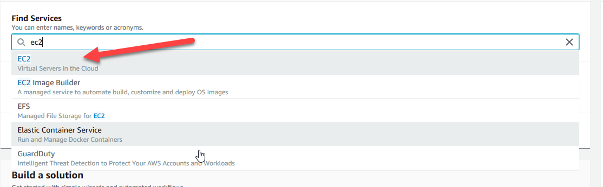
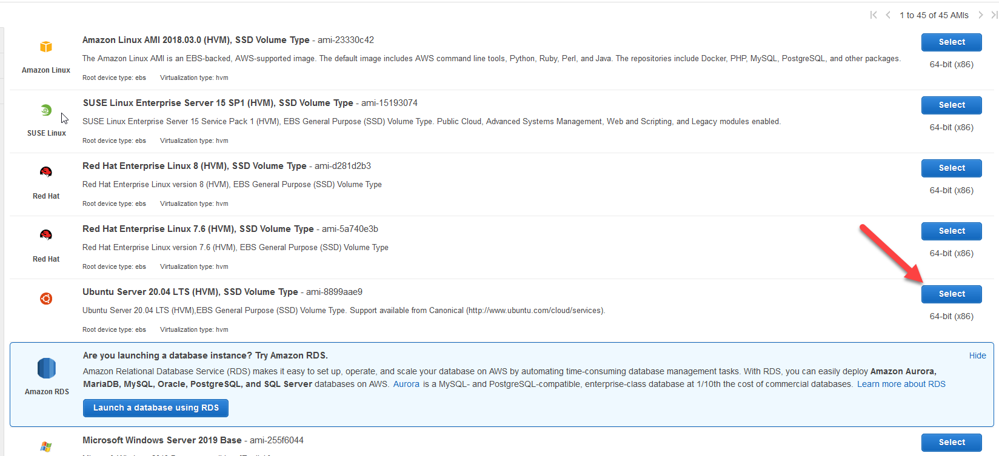
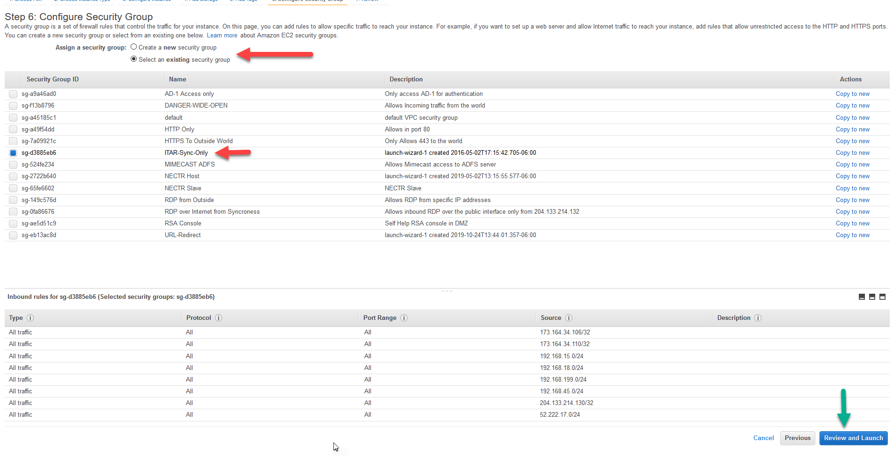
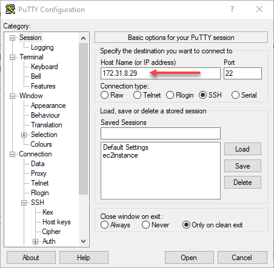
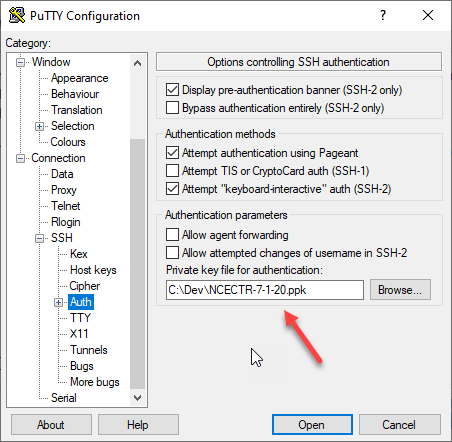
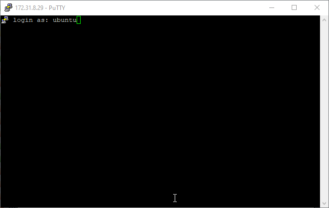

# AWS

## Creating AMI for Jenkins slaves -- LINUX
Navigate to the AWS EC2 console, by logging in and typing EC2 in the search bar.

Click the orange Launch instance button and select Launch instance.

Select the appropriate base distro to create your own image. Here we'll use Ubuntu Server 20.04 LTS(HVM), SSD Volume Type. Generallly, select the newest version unless otherwise needed.

Select the appropriate instance type based on virtual CPUs/Memory size. For example, we'll use t2.micro. After selecting the right type, click Next until reaching the security group menu.
Click "Select an existing security group" and choose "ITAR-Sync-Only". Then click "Review and Launch". On the next page click "Launch".

You will need to have a key pair for authentication (.ppk saved on your local machine). Choose your key pair and click "Launch Instance". Then click "View Instances". Locate your instance, right click -> Networking -> Manage IP Addresses and copy your private IP.

Once your instance is running, launch PuTTY to connect to it via ssh. Under host name paste your private IP. 

Then, under SSH->Auth, click Browse and locate your .ppk private key

Click "Open" and login as your distro's default user.

We'll need to install OpenJDK/JRE. Use your distro's package manager. In the case of Ubuntu, run:

sudo apt-get update

sudo apt-get install openjdk-8-jdk
